# Plant Selection

## Plant Category

### Stem Plants

Stem plants are those that grow vertically, they absorb nutrient from both water column and substrate.

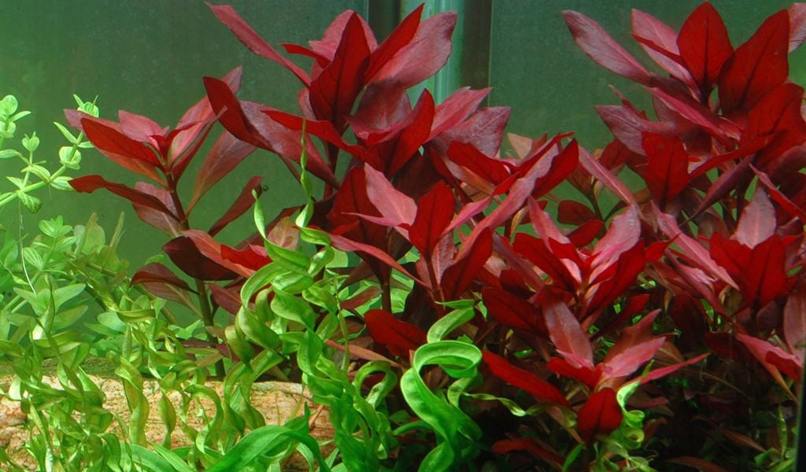

### Rosette Plants

Rosette plants are that look like flower. They have a base structure called crown from where leaves emerge in a fan shaped manner.

### Epiphyte Plants

Epiphytes are plants that does not require soil. Instead they need a surface to grab onto. So you can go without any nutritious soil. They absorb primarily through water column.

### Floating Plants

Floating plants contribute the most in keeping the water clean. With access to direct CO2 from air. They can process waste very fast. But most of them are weak to strong surface agitation.

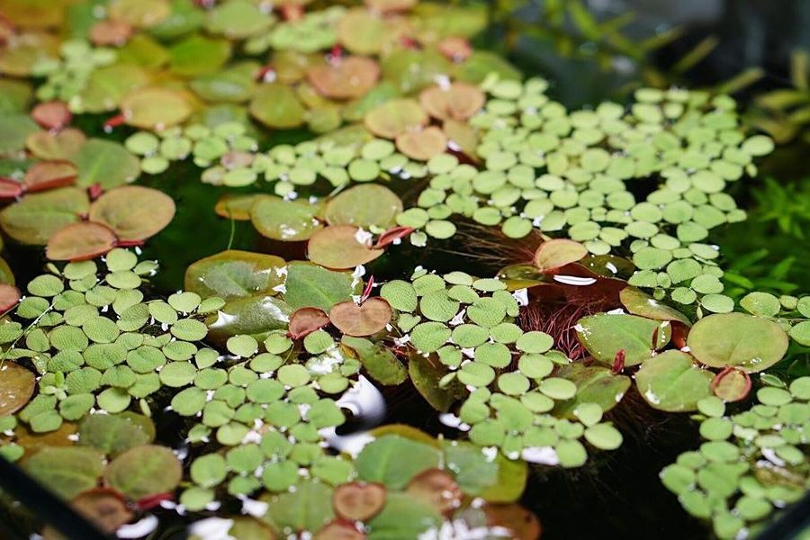

## Low Light

### Green Hygro

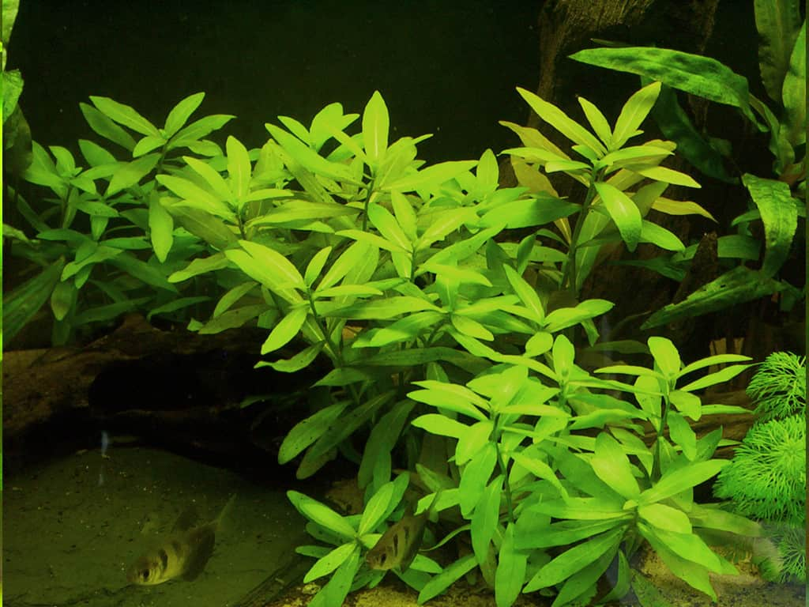

Green Hygro is a fast-growing stem plant with long, narrow leaves that will grow densely, creating a lush background. It's a great beginner plant that helps absorb excess nutrients and outcompete algae.

!!! note
    - **Plant Type:** Stem Plant
    - **Scientific Name:** *Hygrophila polysperma*
    - **Hardiness:** Very hardy
    - **Growth Rate:** Fast
    - **Light:** Low to moderate
    - **CO2:** Not required
    - **Water Parameters:** Adapts to a wide range of conditions
    - **Nutrient Absorption:** Excellent
    - **Placement:** Background
    - **Care:** Easy, requires regular trimming

### Sunset Hygro

Sunset Hygro is a beautiful variant of *Hygrophila polysperma*. It features distinctive leaf venation that can turn pink or orange under good lighting, providing a nice splash of color in a low-tech tank.

!!! note
    - **Plant Type:** Stem Plant
    - **Scientific Name:** *Hygrophila polysperma ‘Rosanervig’*
    - **Hardiness:** Hardy
    - **Growth Rate:** Fast
    - **Light:** Low to moderate
    - **CO2:** Not required, but enhances color
    - **Water Parameters:** Adapts to a wide range
    - **Nutrient Absorption:** Excellent
    - **Placement:** Midground to background
    - **Care:** Easy, requires trimming to maintain shape

### Rotala Rotundifolia

Rotala Rotundifolia is a popular stem plant that is easy to grow and can be used to create a dense, bushy look. In low light, it will remain green, but it can develop beautiful red-orange tones under brighter lighting.

!!! note
    - **Plant Type:** Stem Plant
    - **Scientific Name:** *Rotala rotundifolia*
    - **Hardiness:** Hardy
    - **Growth Rate:** Fast
    - **Light:** Low to moderate
    - **CO2:** Not required, but enhances color
    - **Water Parameters:** Tolerates a wide range
    - **Nutrient Absorption:** High
    - **Placement:** Midground to background
    - **Care:** Easy, requires regular trimming

### Rotala Indica

*Rotala Indica* is a different species from *Rotala Rotundifolia* but is often confused with it. It typically has smaller, more densely packed leaves and stays a vibrant green.

!!! note
    - **Plant Type:** Stem Plant
    - **Scientific Name:** *Rotala indica*
    - **Hardiness:** Hardy
    - **Growth Rate:** Moderate
    - **Light:** Low to moderate
    - **CO2:** Not required
    - **Water Parameters:** Prefers soft, slightly acidic water
    - **Nutrient Absorption:** High
    - **Placement:** Midground
    - **Care:** Easy

### Hornwort

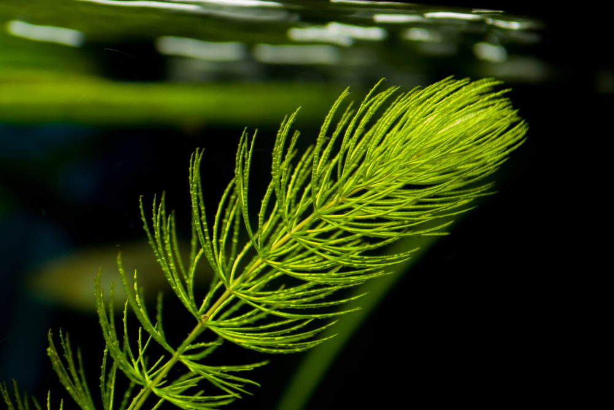

Hornwort is a unique plant with a stiff, needle-like appearance. It can be planted in the substrate, but it is often used as a floating plant. It grows exceptionally fast and is a powerful nutrient sponge.

!!! note
    - **Plant Type:** Stem Plant
    - **Scientific Name:** *Ceratophyllum demersum*
    - **Hardiness:** Extremely hardy
    - **Growth Rate:** Very fast
    - **Light:** Low to moderate
    - **CO2:** Not required
    - **Water Parameters:** Tolerates a wide range of conditions
    - **Nutrient Absorption:** Extremely high
    - **Placement:** Floating or background
    - **Care:** Low-maintenance

### Parrots Feather

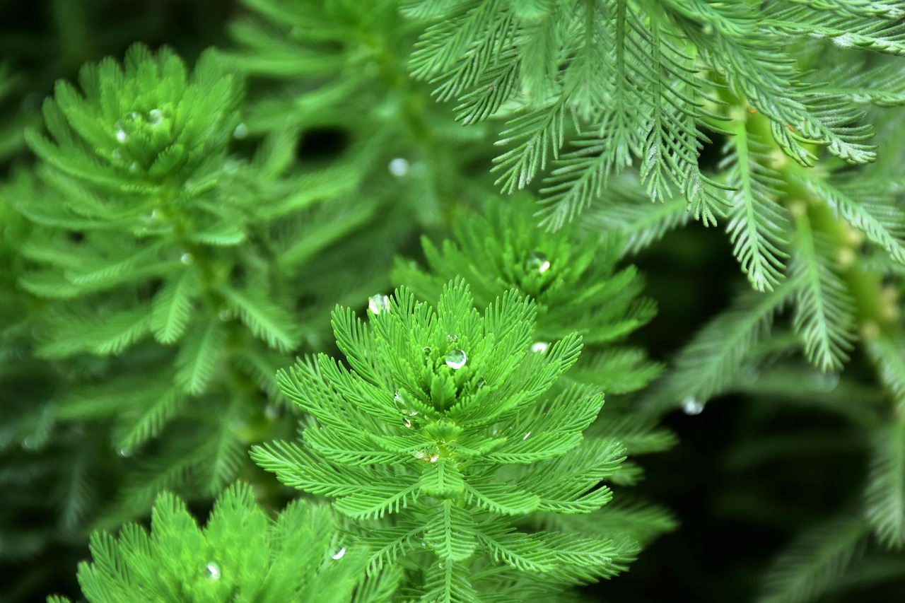

This plant is known for its beautiful, feathery appearance. It is a semi-aquatic plant, and it is most often used with its stems emerging from the water. It can survive fully submerged but may not thrive in all conditions.

!!! note
    - **Plant Type:** Stem Plant
    - **Scientific Name:** *Myriophyllum aquaticum*
    - **Hardiness:** Moderate
    - **Growth Rate:** Fast
    - **Light:** Moderate to high
    - **CO2:** Not required
    - **Water Parameters:** Prefers cool, clean water
    - **Nutrient Absorption:** High
    - **Placement:** Background or emersed
    - **Care:** Requires regular trimming

### Moneywort

Moneywort is a beautiful, easy-to-grow stem plant with small, round leaves that grow in pairs along the stem. It's a great choice for midground planting and adds a different texture to an aquascape.

!!! note
    - **Plant Type:** Stem Plant
    - **Scientific Name:** *Bacopa monnieri*
    - **Hardiness:** Very hardy
    - **Growth Rate:** Moderate
    - **Light:** Low to moderate
    - **CO2:** Not required
    - **Water Parameters:** Tolerates a wide range
    - **Nutrient Absorption:** Moderate
    - **Placement:** Midground
    - **Care:** Easy, requires trimming

### Brazilian Pennywort

Brazilian Pennywort is a fast-growing plant with vibrant, light-green leaves that resemble small lily pads. It can be planted in the substrate or left to float, where it will spread quickly across the water surface.

!!! note
    - **Plant Type:** Stem Plant
    - **Scientific Name:** *Hydrocotyle leucocephala*
    - **Hardiness:** Very hardy
    - **Growth Rate:** Fast
    - **Light:** Low to moderate
    - **CO2:** Not required
    - **Water Parameters:** Tolerates a wide range
    - **Nutrient Absorption:** High
    - **Placement:** Midground or floating
    - **Care:** Easy, requires regular trimming

### Guppy Grass

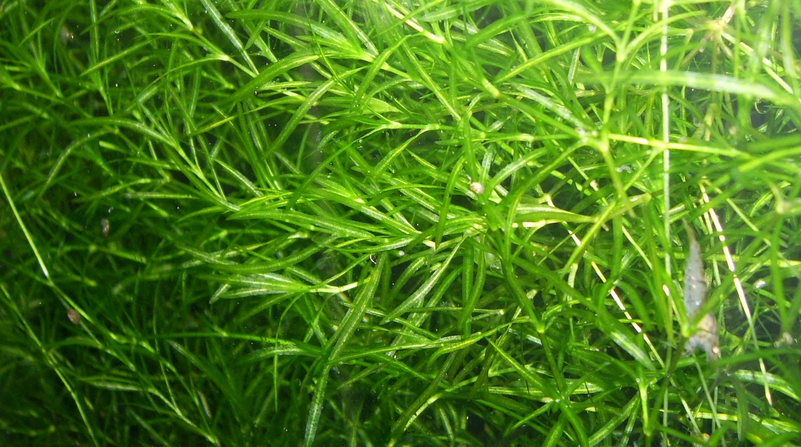

Guppy Grass is a fast-growing, fine-leaved plant that is often used as a floating or loosely planted plant. Its dense growth provides excellent shelter for fish fry and shrimp.

!!! note
    - **Plant Type:** Stem Plant
    - **Scientific Name:** *Najas guadalupensis*
    - **Hardiness:** Very hardy
    - **Growth Rate:** Fast
    - **Light:** Low to moderate
    - **CO2:** Not required
    - **Water Parameters:** Tolerates a wide range of conditions
    - **Nutrient Absorption:** Excellent
    - **Placement:** Floating or midground
    - **Care:** Easy, requires regular trimming

### Bacopa

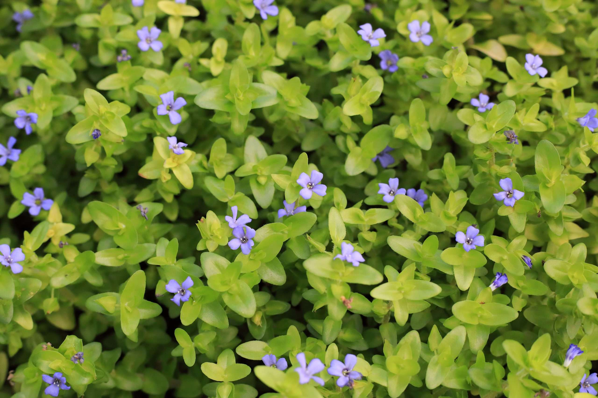

Bacopa is a great beginner plant with sturdy stems and small, thick leaves. It's a classic midground plant that can add a splash of green to your tank.

!!! note
    - **Plant Type:** Stem Plant
    - **Scientific Name:** *Bacopa caroliniana*
    - **Hardiness:** Hardy
    - **Growth Rate:** Moderate
    - **Light:** Low to moderate
    - **CO2:** Not required
    - **Water Parameters:** Tolerates a wide range
    - **Nutrient Absorption:** Moderate
    - **Placement:** Midground
    - **Care:** Easy, requires trimming

### American Waterweed

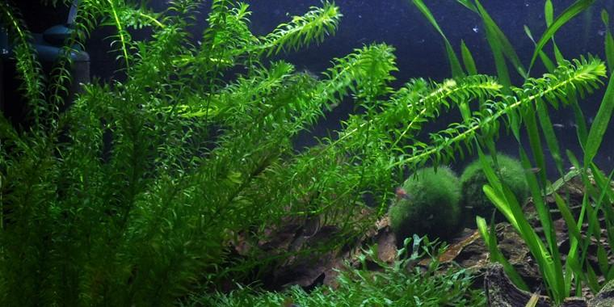

American Waterweed is a fast-growing, classic beginner stem plant. It's a very effective nutrient absorber that's great for new tanks.

!!! note
    - **Plant Type:** Stem Plant
    - **Scientific Name:** *Elodea canadensis*
    - **Hardiness:** Very hardy
    - **Growth Rate:** Fast
    - **Light:** Low to moderate
    - **CO2:** Not required
    - **Water Parameters:** Prefers cooler water
    - **Nutrient Absorption:** High
    - **Placement:** Background
    - **Care:** Easy, requires regular trimming

### Red Ludwigia

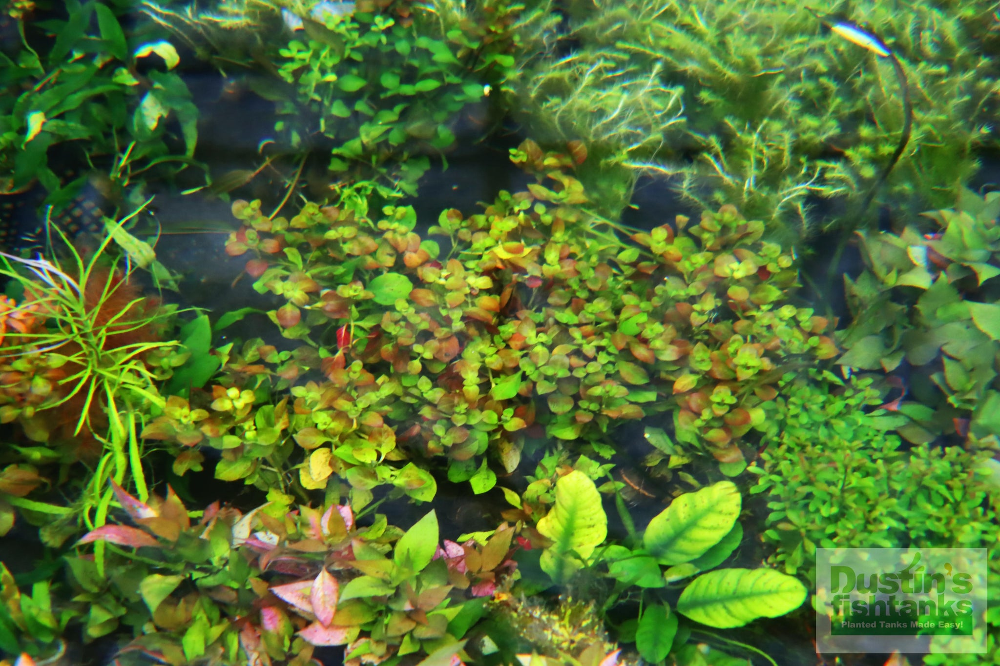

Red Ludwigia is a popular stem plant known for its beautiful red and orange leaves. While it will grow in low light, it will not develop its full color without more intense lighting.

!!! note
    - **Plant Type:** Stem Plant
    - **Scientific Name:** *Ludwigia repens*
    - **Hardiness:** Hardy
    - **Growth Rate:** Fast
    - **Light:** Low to high
    - **CO2:** Not required, but enhances color
    - **Water Parameters:** Tolerates a wide range
    - **Nutrient Absorption:** High
    - **Placement:** Midground to background
    - **Care:** Easy, requires trimming

### Water Wisteria

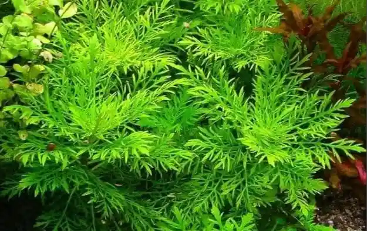

Water Wisteria is a fast-growing plant with feathery, delicate leaves. It is an excellent background plant that can be rooted in the substrate or left to float.

!!! note
    - **Plant Type:** Stem Plant
    - **Scientific Name:** *Hygrophila Difformis*
    - **Hardiness:** Very hardy
    - **Growth Rate:** Fast
    - **Light:** Low to moderate
    - **CO2:** Not required
    - **Water Parameters:** Tolerates a wide range
    - **Nutrient Absorption:** High
    - **Placement:** Background
    - **Care:** Easy, requires regular trimming

### Lemon Bacopa

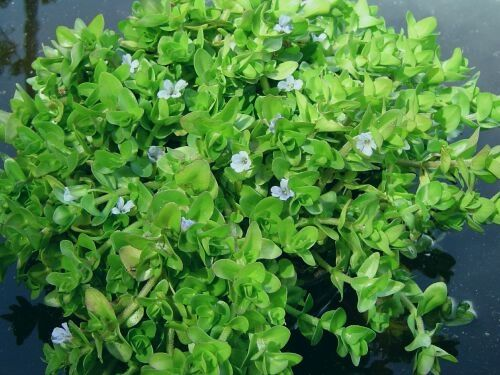

Lemon Bacopa is a variety of Bacopa with a lighter green color and a subtle lemon scent when crushed. It is a great midground plant.

!!! note
    - **Plant Type:** Stem Plant
    - **Scientific Name:** *Bacopa caroliniana ‘Lemon Bacopa’*
    - **Hardiness:** Hardy
    - **Growth Rate:** Moderate
    - **Light:** Low to moderate
    - **CO2:** Not required
    - **Water Parameters:** Tolerates a wide range
    - **Nutrient Absorption:** Moderate
    - **Placement:** Midground
    - **Care:** Easy

### Cryptocoryne Wendtii

Cryptocoryne Wendtii is a common and very popular rosette plant. It is a slow to moderate grower that comes in a variety of colors, including green, brown, and reddish tones. It is known to melt its leaves when first planted but will bounce back.

!!! note
    - **Plant Type:** Rosette Plant
    - **Scientific Name:** *Cryptocoryne wendtii* (various varieties)
    - **Hardiness:** Hardy
    - **Growth Rate:** Slow to moderate
    - **Light:** Low to moderate
    - **CO2:** Not required
    - **Water Parameters:** Prefers stable conditions, pH 6.0-7.5
    - **Nutrient Absorption:** Root feeder, benefits from root tabs
    - **Placement:** Foreground to midground
    - **Care:** Easy, but sensitive to water changes

### Cryptocoryne Balansae

Cryptocoryne Balansae is a very different-looking crypt with long, narrow, and often wavy leaves. It is a great background plant for a low-tech tank, creating a unique, grassy look.

!!! note
    - **Plant Type:** Rosette Plant
    - **Scientific Name:** *Cryptocoryne balansae*
    - **Hardiness:** Hardy
    - **Growth Rate:** Slow to moderate
    - **Light:** Low to moderate
    - **CO2:** Not required
    - **Water Parameters:** Prefers stable conditions
    - **Nutrient Absorption:** Root feeder
    - **Placement:** Background
    - **Care:** Easy, but sensitive to water changes

### Cryptocoryne Spiralis

Cryptocoryne Spiralis is another tall Crypt that is great for a natural background. It has long, slender, and slightly twisted leaves that will sway in the water current.

!!! note
    - **Plant Type:** Rosette Plant
    - **Scientific Name:** *Cryptocoryne spiralis*
    - **Hardiness:** Hardy
    - **Growth Rate:** Slow to moderate
    - **Light:** Low to moderate
    - **CO2:** Not required
    - **Water Parameters:** Tolerates a wide range
    - **Nutrient Absorption:** Root feeder
    - **Placement:** Background
    - **Care:** Easy

### Micro Crypt

Micro Crypt is a tiny version of the Cryptocoryne genus, perfect for a foreground accent. It is a slow grower but incredibly hardy once established.

!!! note
    - **Plant Type:** Rosette Plant
    - **Scientific Name:** *Cryptocoryne petchii*
    - **Hardiness:** Hardy
    - **Growth Rate:** Slow
    - **Light:** Low
    - **CO2:** Not required
    - **Water Parameters:** Prefers stable conditions
    - **Nutrient Absorption:** Root feeder
    - **Placement:** Foreground
    - **Care:** Low-maintenance

### Amazon Sword

The Amazon Sword is a classic aquarium plant with broad, lance-shaped leaves. It is a very popular background or centerpiece plant that is a heavy root feeder.

!!! note
    - **Plant Type:** Rosette Plant
    - **Scientific Name:** *Echinodorus bleheri*
    - **Hardiness:** Very hardy
    - **Growth Rate:** Moderate
    - **Light:** Low to moderate
    - **CO2:** Not required
    - **Water Parameters:** Prefers slightly acidic to neutral water
    - **Nutrient Absorption:** Root feeder, benefits from root tabs
    - **Placement:** Background or centerpiece
    - **Care:** Easy

### Banana Plant

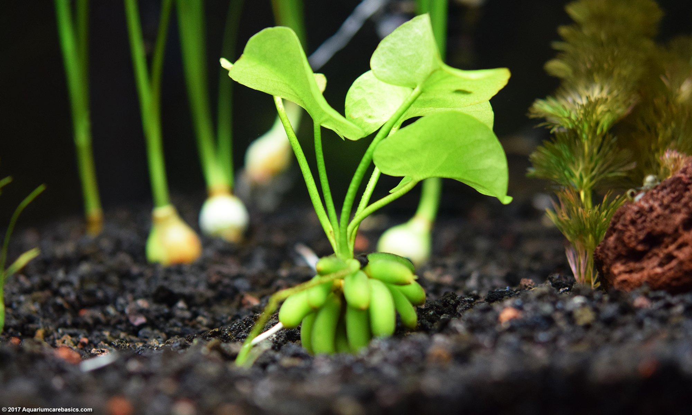

The Banana Plant is a unique, tuberous plant with broad leaves that grow from a "banana"-shaped corm. It is a great foreground plant that can send leaves to the surface of the water.

!!! note
    - **Plant Type:** Rosette Plant
    - **Scientific Name:** *Nymphoides Aquatica*
    - **Hardiness:** Hardy
    - **Growth Rate:** Moderate
    - **Light:** Low to moderate
    - **CO2:** Not required
    - **Water Parameters:** Tolerates a wide range
    - **Nutrient Absorption:** Root feeder, benefits from root tabs
    - **Placement:** Foreground
    - **Care:** Easy

### Java Moss

Java moss is the hardiest plant in the epiphyte family. You can leave a java moss in dark for weeks and still they won't die. Being a moss, they provide shrimps to graze on.

!!! note
    - **Plant Type:** Epiphyte Plant
    - **Scientific Name:** *Taxiphyllum barbieri*
    - **Hardiness:** Very hardy and adaptable
    - **Growth Rate:** Fast
    - **Light:** Low to moderate
    - **CO2:** Not required, but can enhance growth
    - **Water Parameters:** Tolerates a wide range of water conditions
    - **Nutrient Absorption:** Excellent for absorbing excess nutrients and preventing algae
    - **Placement:** Can be attached to rocks, driftwood, or left to form a carpet
    - **Care:** Low-maintenance

### Java Fern

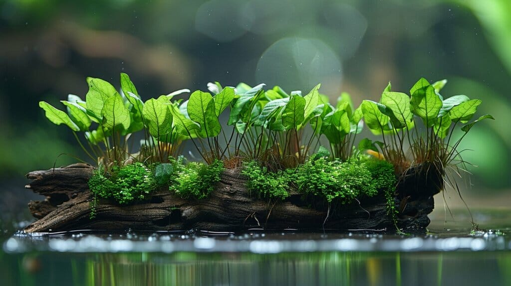

Java Fern is a classic epiphyte with broad, deep green leaves. It is very hardy and should be attached to hardscape to prevent the rhizome from rotting. It is one of the easiest plants to keep.

!!! note
    - **Plant Type:** Epiphyte Plant
    - **Scientific Name:** *Microsorum pteropus*
    - **Hardiness:** Very hardy
    - **Growth Rate:** Slow to moderate
    - **Light:** Low to moderate
    - **CO2:** Not required
    - **Water Parameters:** Tolerates a wide range
    - **Nutrient Absorption:** Moderate
    - **Placement:** Attachable to hardscape
    - **Care:** Easy

### Anubias Barteri

Anubias Barteri is an incredibly tough epiphyte with broad, thick leaves. It's almost indestructible and can survive in a wide range of conditions. It should always be attached to hardscape and never planted in the substrate.

!!! note
    - **Plant Type:** Epiphyte Plant
    - **Scientific Name:** *Anubias barteri*
    - **Hardiness:** Extremely hardy
    - **Growth Rate:** Very slow
    - **Light:** Low to moderate
    - **CO2:** Not required
    - **Water Parameters:** Tolerates a wide range
    - **Nutrient Absorption:** Water column feeder
    - **Placement:** Attachable to hardscape
    - **Care:** Low-maintenance

### Anubias Nana

Anubias Nana is a smaller version of Anubias Barteri with compact leaves. It is often used in the foreground and is just as hardy as its larger relative.

!!! note
    - **Plant Type:** Epiphyte Plant
    - **Scientific Name:** *Anubias barteri var. nana*
    - **Hardiness:** Extremely hardy
    - **Growth Rate:** Very slow
    - **Light:** Low to moderate
    - **CO2:** Not required
    - **Water Parameters:** Tolerates a wide range
    - **Nutrient Absorption:** Water column feeder
    - **Placement:** Attachable to hardscape
    - **Care:** Low-maintenance

### Pelia

Pelia is not a moss but a type of liverwort that forms a beautiful, lush clump in the aquarium. It is excellent for providing shelter for shrimp and is easy to care for.

!!! note
    - **Plant Type:** Epiphyte Plant
    - **Scientific Name:** *Monosolenium tenerum*
    - **Hardiness:** Hardy
    - **Growth Rate:** Slow to moderate
    - **Light:** Low
    - **CO2:** Not required
    - **Water Parameters:** Prefers cooler temperatures
    - **Nutrient Absorption:** Moderate
    - **Placement:** Can be attached to hardscape or left on substrate
    - **Care:** Low-maintenance

### African Water Fern

African Water Fern is a beautiful epiphyte with delicate, lacy leaves. It is a great alternative to Java Fern and grows at a moderate pace, providing a different texture to hardscape.

!!! note
    - **Plant Type:** Epiphyte Plant
    - **Scientific Name:** *Bolbitis heudelotii*
    - **Hardiness:** Hardy
    - **Growth Rate:** Moderate
    - **Light:** Low to moderate
    - **CO2:** Not required
    - **Water Parameters:** Prefers soft, slightly acidic water
    - **Nutrient Absorption:** Water column feeder
    - **Placement:** Attachable to hardscape
    - **Care:** Easy

### Coffee Leaf Anubias

This is a distinctive variety of Anubias with deep green, crinkled leaves. It's just as hardy and low-maintenance as other Anubias varieties and is a great choice for adding a different texture to a tank.

!!! note
    - **Plant Type:** Epiphyte Plant
    - **Scientific Name:** *Anubias barteri v. ‘coffeefolia’*
    - **Hardiness:** Extremely hardy
    - **Growth Rate:** Very slow
    - **Light:** Low
    - **CO2:** Not required
    - **Water Parameters:** Tolerates a wide range
    - **Nutrient Absorption:** Water column feeder
    - **Placement:** Attachable to hardscape
    - **Care:** Low-maintenance

### Peacock Moss

Peacock Moss is a beautiful moss with a distinctive, fan-like growth pattern that resembles a peacock's tail. It is an excellent epiphyte for a detailed aquascape.

!!! note
    - **Plant Type:** Epiphyte Plant
    - **Scientific Name:** *Taxiphyllum sp. 'Peacock'*
    - **Hardiness:** Hardy
    - **Growth Rate:** Moderate
    - **Light:** Low
    - **CO2:** Not required
    - **Water Parameters:** Tolerates a wide range
    - **Nutrient Absorption:** Excellent
    - **Placement:** Attachable to hardscape
    - **Care:** Low-maintenance

### Christmas Moss

Christmas Moss is a moss known for its beautiful, tiered growth pattern that resembles a Christmas tree. It is an excellent epiphyte for creating a lush, detailed aquascape.

!!! note
    - **Plant Type:** Epiphyte Plant
    - **Scientific Name:** *Vesicularia montagnei*
    - **Hardiness:** Hardy
    - **Growth Rate:** Moderate
    - **Light:** Low to moderate
    - **CO2:** Not required
    - **Water Parameters:** Tolerates a wide range
    - **Nutrient Absorption:** Excellent
    - **Placement:** Attachable to hardscape
    - **Care:** Low-maintenance

### Waterwheel Plant (Aldrovanda vesiculosa)

The Waterwheel Plant is a carnivorous, free-floating aquatic plant that traps tiny aquatic invertebrates with snap traps. It is incredibly difficult to keep in a typical aquarium setting and is for advanced hobbyists only.

!!! note
    - **Plant Type:** Floating Plant
    - **Scientific Name:** *Aldrovanda vesiculosa*
    - **Hardiness:** Very difficult
    - **Growth Rate:** Fast
    - **Light:** High
    - **CO2:** Not required
    - **Water Parameters:** Prefers very clean, soft, and acidic water
    - **Nutrient Absorption:** Traps insects and invertebrates
    - **Placement:** Floating
    - **Care:** Very high-maintenance

### Duckweed

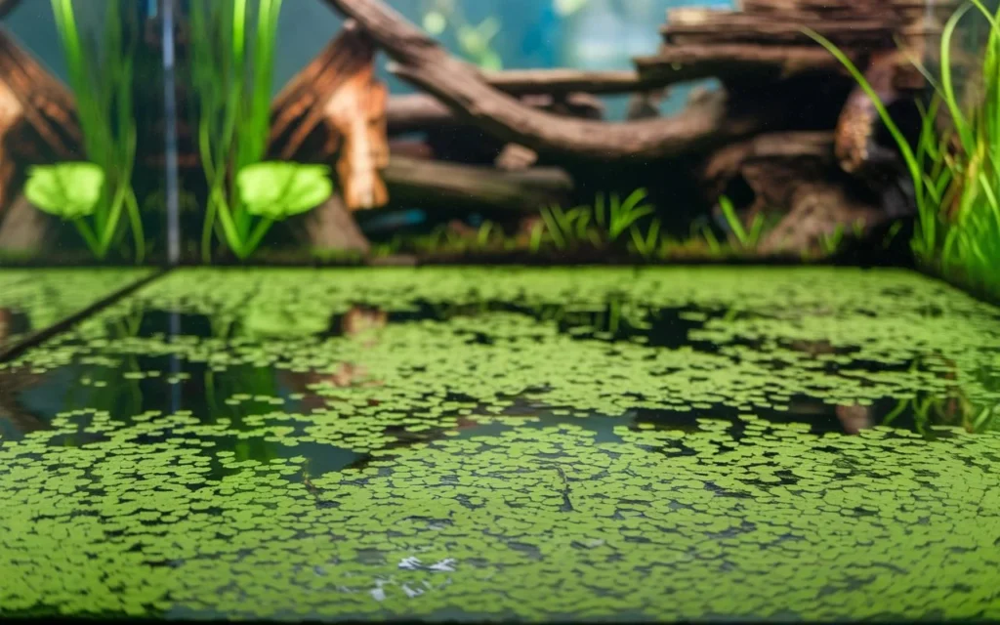

Duckweed is a very small, free-floating plant that reproduces incredibly fast. It is a fantastic nutrient absorber and provides a natural, shaded environment for fish.

!!! note
    - **Plant Type:** Floating Plant
    - **Scientific Name:** *Lemna minor*
    - **Hardiness:** Extremely hardy
    - **Growth Rate:** Very fast
    - **Light:** Low to high
    - **CO2:** Not required
    - **Water Parameters:** Tolerates a wide range
    - **Nutrient Absorption:** Excellent
    - **Placement:** Floating
    - **Care:** Can be difficult to manage due to rapid growth

### Amazon Frogbit

Amazon Frogbit is a beautiful floating plant with broad, lily pad-like leaves and long, intricate roots. It provides a natural canopy and is excellent at absorbing excess nutrients from the water.

!!! note
    - **Plant Type:** Floating Plant
    - **Scientific Name:** *Limnobium laevigatum*
    - **Hardiness:** Hardy
    - **Growth Rate:** Fast
    - **Light:** Low to high
    - **CO2:** Not required
    - **Water Parameters:** Tolerates a wide range
    - **Nutrient Absorption:** Excellent
    - **Placement:** Floating
    - **Care:** Easy, requires a calm water surface
  
### Salvinia

Salvinia is an excellent floating plant for low-tech aquariums. It is a fantastic nutrient absorber and provides a natural canopy and hiding spots for fish. It grows in a wide range of water parameters and is easy to care for.

!!! note
    - **Plant Type:** Floating Plant
    - **Scientific Name:** *Salvinia sp.*
    - **Hardiness:** Very hardy
    - **Growth Rate:** Mid to fast
    - **Light:** Low to high
    - **CO2:** Not required
    - **Water Parameters:** Tolerates a wide range of conditions
    - **Nutrient Absorption:** Excellent
    - **Placement:** Floating
    - **Care:** Low-maintenance, requires occasional removal of excess growth

### Marimo Ball

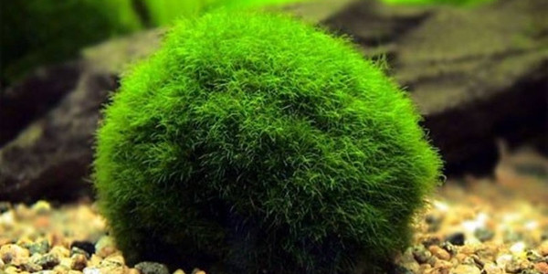

A Marimo Ball is a ball of green algae, very low-maintenance and provides grazing surfaces for invertebrates. It grows very slowly and adds a unique aesthetic to a tank.

!!! note
    - **Plant Type:** Algae
    - **Scientific Name:** *Aegagropila linnaei*
    - **Hardiness:** Extremely hardy
    - **Growth Rate:** Very slow
    - **Light:** Low
    - **CO2:** Not required
    - **Water Parameters:** Tolerates a wide range
    - **Nutrient Absorption:** Moderate
    - **Placement:** Anywhere
    - **Care:** Very low-maintenance