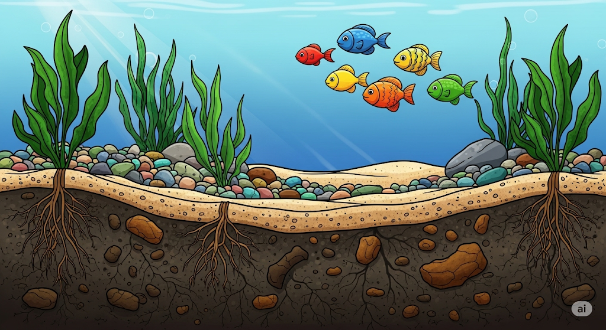
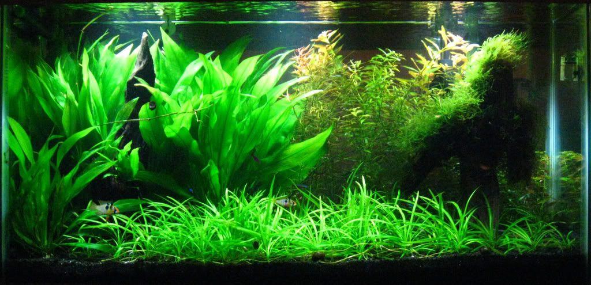
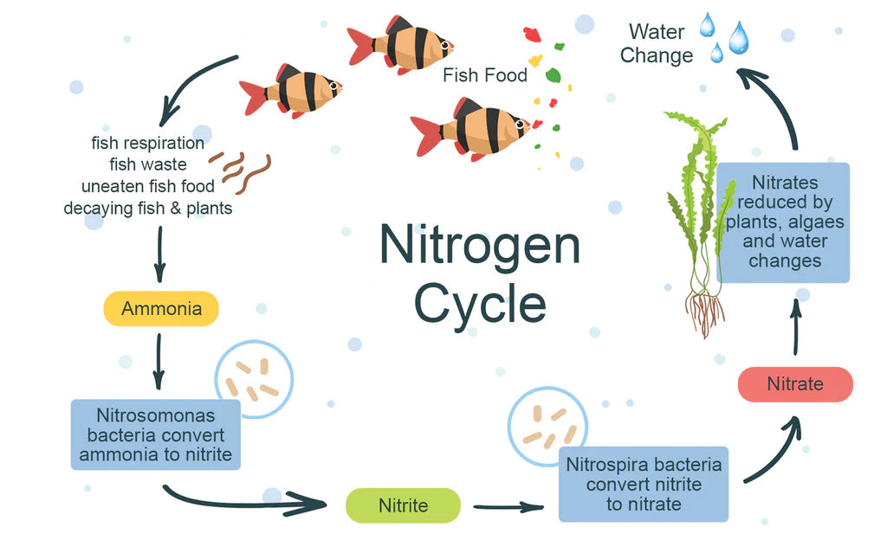
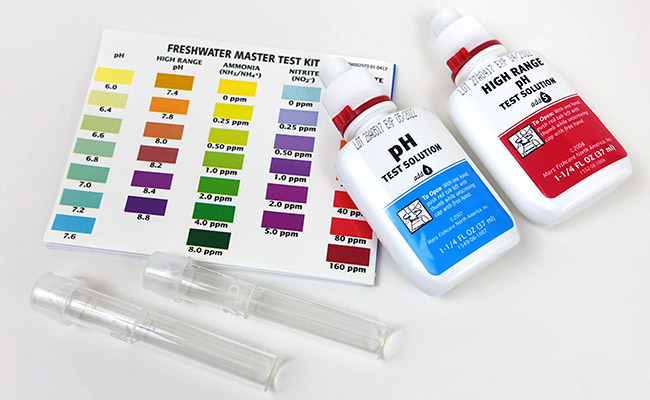

# Tank Setup

## Tank or Container

You don't need a fancy glass tank to keep your fish happy. Just a container that lets your fish swim freely and is big enough to keep water parameters stable while your fish produce waste.

!!! warning
    You cannot go below 5 gallons. The smaller the tank, the faster water parameters change due to fish waste.

## Substrate

You can use stones as substrate, sands or Amazon aqua soil or no substrate at all.

If you want to use live plants, I suggest using river sand or construction sand. You can use stones or pool sand, but if the substrate particles are too fine, they can disrupt root growth. If they are too large, plants have a hard time attaching to the substrate.

Some plants can absorb nutrients from the water column (the water above the substrate). However, most plants thrive when there are nutrients in the substrate. You can use Amazon Aqua Soil, which is risk-free and hassle-free but very expensive. Alternatively, you can use the cheap dirt tank method, which involves 1 inch of rich garden soil covered by 1 or more inches of sand. 

!!! warning
    Make sure the sand layer is thick enough to prevent dirt from leaching out.

!!! warning
    If you use Amazon soil or dirt, you must not add fish for several weeks. The nutrient leaching can kill them. This is the perfect time to add nutrient-absorbing plants such as hornworts or duckweeds to clear the excess nutrients. Alternatively, do frequent water changes to prevent algae bloom (though algae is actually beneficial, just not aesthetically pleasing).

## Filtration

Filtration is needed in your aquarium for several important reasons. First, it creates surface agitation, which allows gas exchange between water and atmosphere. This lets built-up gases from fish and fish waste escape to the atmosphere while tank water gets replenished with oxygen. Second, filtration creates water flow. Stagnant water is an ideal environment for harmful bacteria to breed, so filtration keeps water free from diseases. There are 4 main types of filters: sponge filters, canister filters, HOB filters, and internal filters. Details on filters are in the [Filtration](/aquarium/basics/2_filtration) section.

## Plants and Decorations

If you want to lower maintenance work, plant heavily. Plants significantly help absorb most of the waste. Try adding a mix of tall plants, small plants, and large plants. Tall plants absorb nutrients from water while other plants absorb nutrients from the substrate. Some easy, popular, and cheap plants are:

- **Sagittaria** for small foreground
- **Rotala** for tall background  
- **Amazon Sword** for center large plant

You can also add rocks to create a beautiful structure. This is also beneficial for the tank. Rocks provide hiding spaces for the fish and expand the surface area of the overall tank to allow more bacterial colonies to grow. Porous rocks like lava rocks are especially effective.

## Cycling

Cycling is a necessary part of tank setup that is often ignored by newcomers. What is cycling?

Cycling is, in short, establishing beneficial bacteria in your tank before adding fish.

Your fish produce lots of waste, which is toxic to them in high concentrations. For fish to remain healthy in your tank, you need an ecosystem of beneficial bacteria to process these toxic byproducts.

When you leave a tank for about a month with a small amount of fish food in it, the nutrients released in the water help build up this bacterial ecosystem. If you touch the surface of the water and feel a slimy layer, don't be disgusted—that's the beneficial bacterial colony that will process your fish waste into less toxic substances.

## Fish Acclimation

Before adding fish to your new tank. You need to make sure its adjusted to water. This is because many fish species are not used to sudden water change. So adding them to new water instantly might shock them. Which can sometimes kill them

## Maintenance

You can maintain your tank in two ways: either do small water changes every one or two days (cost-free), or buy water test kits and change water based on test results.

I recommend heavily planting with live plants. You can also use house plants like pothos (which is much more efficient due to access to the atmosphere). Just place them in a pot with holes and make sure the leaves are above water level while roots are below. They will absorb most of the waste, provided there's a sufficient bacterial colony to pre-process it. This reduces the water change frequency by half or more, based on plant number.

You can buy test kits for each water parameter. There are ammonia, nitrate, nitrite, and various other compounds or minerals. You can find them at your local fish store or online.

