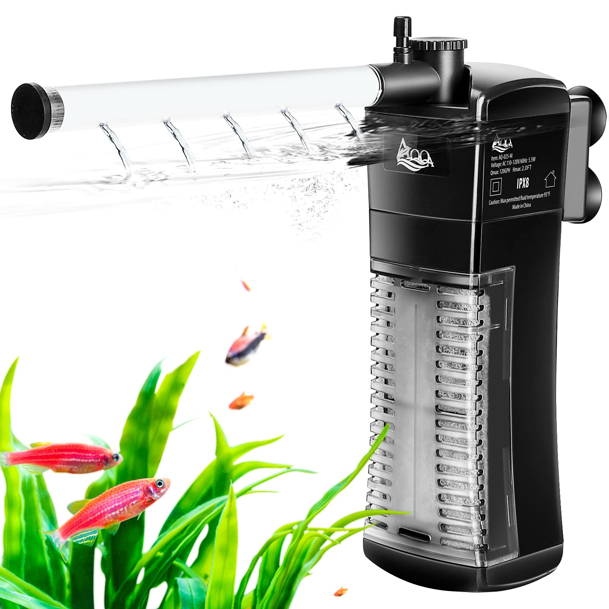
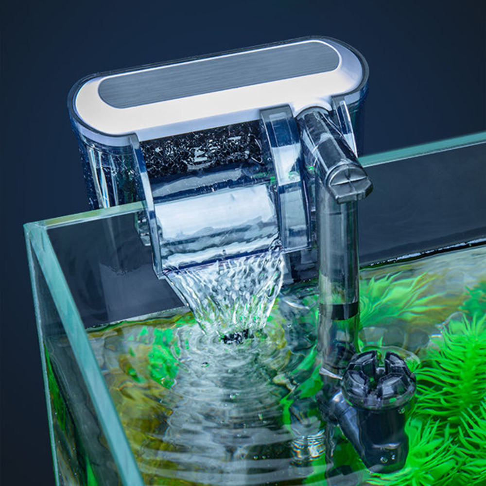
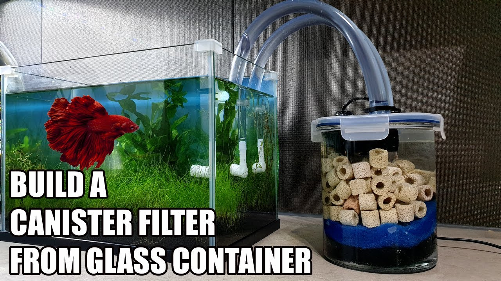

# Filtration

Here is a list of some popular filters and their pros and cons.

## Sponge Filter

A sponge filter is one of the cheapest solutions. Though they cost the same as an internal filter, sponge filters come in two parts: the air pump and the filter sponge that is submerged in water.

Each part is expected to be very durable because the mechanical part (air pump) stays out of the water. The only way it can be damaged is through normal wear over time. Since it comes in two parts, any damaged component can be replaced without needing to replace the entire system.

Sponge filters create a gentle flow, which is ideal for fish that prefer calm water, like Betta fish. They are also very easy to clean—just remove the sponge and squeeze the dirt out under running water. However, they are not aesthetically pleasing.

## Internal Filter

Internal filters work by being completely submerged in water. However, because the entire mechanical part is underwater, they can be damaged by large particles. Typical cheap internal filters do not have flow control, making them suitable for fish that enjoy strong currents but not ideal for fish like Bettas.

!!! warning
    Old internal filters have a slight chance of electrocuting the water. So be extra careful

## HOB Filter

HOB (Hang-On-Back) filters are among the cleanest filters that remain affordable. They cost about the same as sponge filters to twice as much. The main filter unit hangs on the back of the tank while a small intake tube goes into the tank to draw water. The filter creates a gentle waterfall-like flow that's pleasant to watch. However, HOB filters can be easily damaged by sand particles getting sucked into the motor. Some HOB filters come with protein skimmers that help remove oily surface films.

## Canister Filter

Canister filters are the most expensive option while also being the most effective. The filter is so large that it requires separate space, usually in a cabinet below the tank. It draws water through one tube and returns filtered water through another. Canister filters are the most efficient filtration system available, but they are also the most complex to set up and maintain.

