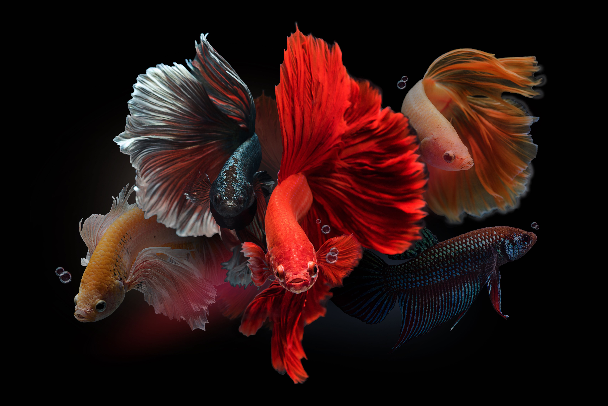
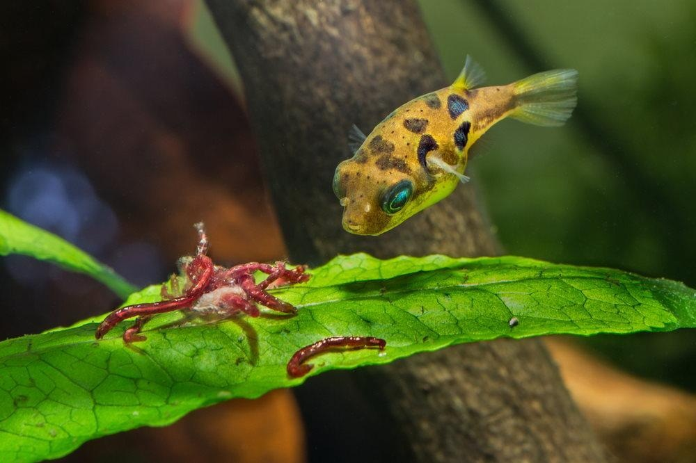
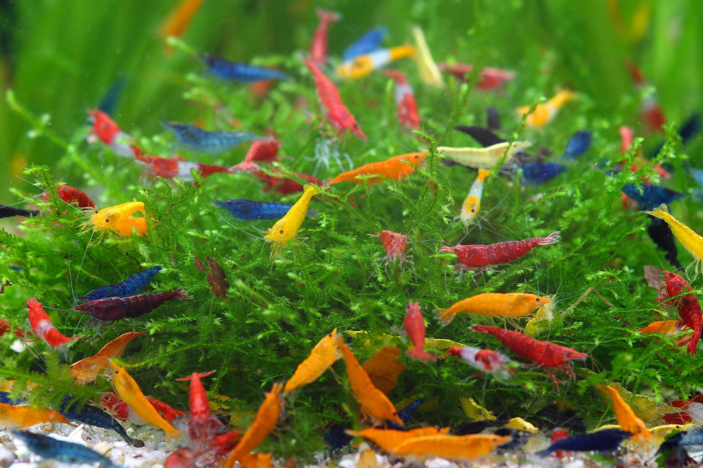
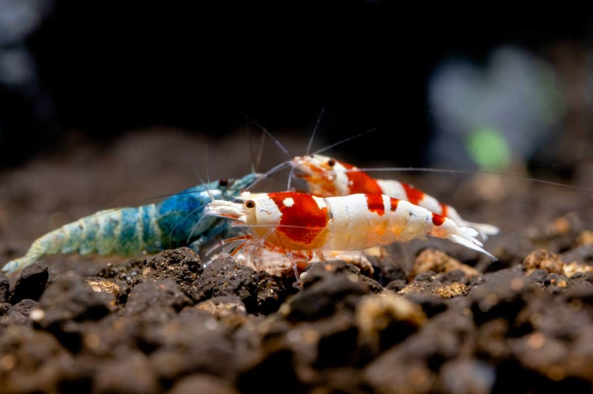

# Fish Selection

Your fish selection generally depends on your tank size and how much maintenance you can do.

## 5 Gallon

Since 5 gallons is a very small volume, it can hold only a few fish that are territorial and have adapted to low oxygen environments.

### Betta

The Betta fish is the most iconic fish in the aquarium hobby. This one fish has so much variety that it can range from $1 to $20, and most of them are among the most beautiful fish in the hobby. The combination of various color patterns and fin types creates an ideal fish for every aquarist.

The Betta fish is also favored for its personality. There are Betta fish that are extremely shy, and there are ones that are super aggressive. The way they look at something, thinking if it's edible, is adorable.

!!! note
    - **Temperature:** 76-81°F (Tropical)
    - **pH Level:** 6.5-7.5 (Neutral to slightly acidic)
    - **Diet:** Carnivorous

!!! warning
    Don't use filtration that produces strong flow in the tank. The Betta fish's body has adapted to living in still water bodies, so strong water flow will constantly push the fish around, causing stress.

### Dwarf Pea Puffer

Not studied yet

### Fresh Water Shrimp

Fresh water shrimp are tiny critters that are easy to maintain and beautiful to look at. They can also be kept with other fish, provided that they are not aggressive, because they produce very little waste. Under good conditions, they will lay about 20 eggs, so you can expect to have 6 to 100 shrimp in a few months.

!!! note
    **Diet:** Bacterial biofilm, blanched vegetables, shrimp pellets

!!! warning
    Before adding shrimps to new water, make sure to drip acclimation. As sudden water parameter change can kill them.

Fresh water shrimp come in two categories: Caridina Shrimp (Crystal Red, Bee, Blue Bolt) or Neocaridina Shrimp (e.g., Cherry, Amano, Blue Dream).

The Neocaridina are hardier, so they are easier to keep and maintain, but they lack intricate color patterns.

!!! note "Neocaridina Shrimp Parameters"
    - **Temperature:** 65-80°F (Warm water)
    - **pH Level:** 6.5-8.0 (Neutral water)
    - **GH (General Hardness):** 6-12 dGH (High minerals)
    - **KH (Carbonate Hardness):** 2-8 dKH (Water stability)
    - **TDS (Total Dissolved Solids):** 150-300 ppm (Rich water)

The Caridina shrimp are a little harder to keep, but they are more beautiful in coloration.

!!! note "Caridina Shrimp Parameters"
    - **Temperature:** 65-74°F (Cool water)
    - **pH Level:** 5.5-6.8 (Soft water)
    - **GH (General Hardness):** 4-6 dGH (Low minerals)
    - **KH (Carbonate Hardness):** 0-2 dKH (Low stability)
    - **TDS (Total Dissolved Solids):** 100-200 ppm (Soft water)